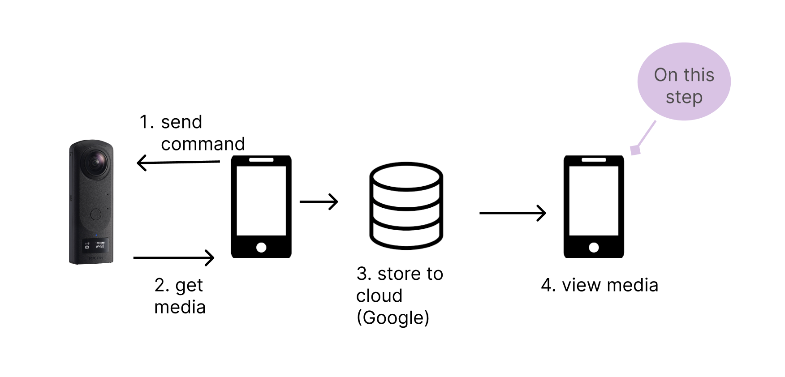
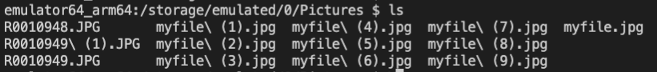
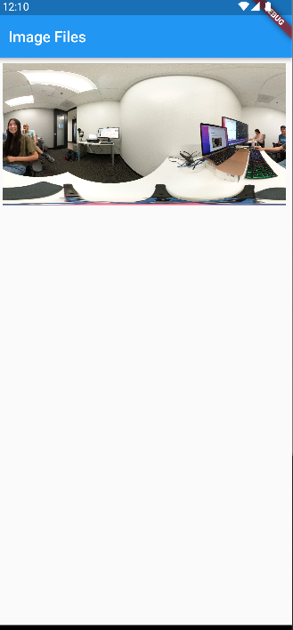
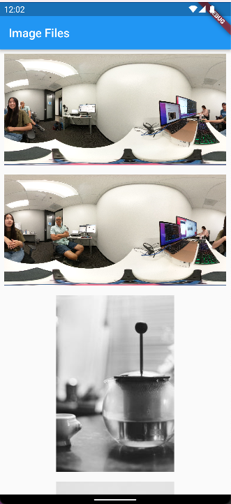

# 11. Picking an Image File and Displaying it

## Overview

This project finds an image file from the device's local storage and displays it on the screen. The main concept is using the `Image.file` in conjunction with the Flutter plugin [permission_handler](https://pub.dev/packages/permission_handler).



The project follows the tutorial by Ivan Andrianto linked [here](https://www.woolha.com/tutorials/flutter-display-image-from-file-examples#:~:text=In%20Flutter%2C%20displaying%20an%20image,you%20can%20also%20use%20FileImage%20)

## Storage Permissions 

 Accessing a file from local storage requires permissions. To manage this, import the `permission_handler` plugin into the project. The package requires three steps before use in Android. 
 
 1. Add these two lines to the `gradle.properties` file:

 ```dart
    android.useAndroidX=true
    android.enableJetifier=true
 ```

 2. Assign the `compileSdkVersion` to 33 in the `android/app/build.gradle` file:

 ```dart
android {
    compileSdkVersion 33}
 ```

 3. Add the [permissions](https://github.com/Baseflow/flutter-permission-handler/blob/master/permission_handler/example/android/app/src/main/AndroidManifest.xml) to the `AndroidManifest.xml` file in the `main` folder.

```dart
 <uses-permission android:name="android.permission.INTERNET"/>
       <uses-permission android:name="android.permission.READ_EXTERNAL_STORAGE"/>
    <uses-permission android:name="android.permission.WRITE_EXTERNAL_STORAGE"/>
<uses-permission android:name="android.permission.MANAGE_EXTERNAL_STORAGE" />
```

This project models the code example from `permission_handler` for the permission settings. Inside a class called `ImageFile` add the below code:

```dart
 PermissionStatus _permissionStatus = PermissionStatus.denied;

  @override
  void initState() {
    super.initState();

    _listenForPermissionStatus();
  }

  void _listenForPermissionStatus() async {
    final status = await Permission.storage.status;
    print(status);
    setState(() => _permissionStatus = status);
  }
```

The state of `_permissionStatus` is set to the storage status. The `Permission` status will be `granted`, `denied`, `restricted`, or `permanentlyDenied`. If the `_permissionStatus` is equal to `PermissionStatus.granted`, then the Column is displayed.

```dart
 if (_permissionStatus == PermissionStatus.granted) {
      return SingleChildScrollView(
          child: Column(  children: [
        
                Image.file(File('/storage/emulated/0/Pictures/R0010948.JPG')),
    ],))}
```

## Image File

The `Image.file` takes in the location of the image in local storage. Using `adb shell` in the terminal will navigate to the emulator. From there, find the location of the images. 



Now, the app should display the image:



Experiment and add multiple images:



